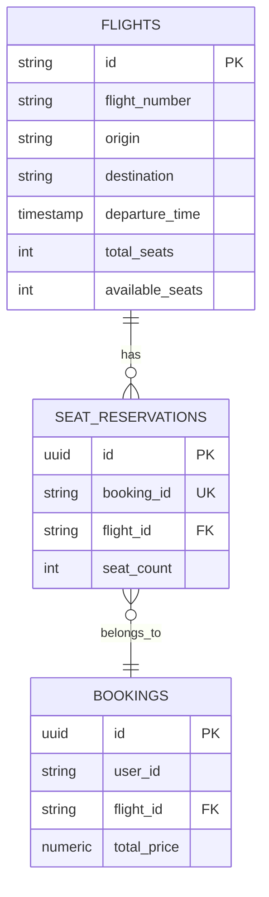

# ER Diagram

```mermaid
erDiagram
    FLIGHTS ||--o{ SEAT_RESERVATIONS : "has"
    SEAT_RESERVATIONS }o--|| BOOKINGS : "belongs_to"
    FLIGHTS {
        string id PK
        string flight_number
        string origin
        string destination
        timestamp departure_time
        int total_seats
        int available_seats
    }
    SEAT_RESERVATIONS {
        uuid id PK
        string booking_id UK
        string flight_id FK
        int seat_count
    }
    BOOKINGS {
        uuid id PK
        string user_id
        string flight_id FK
        numeric total_price
    }
```
